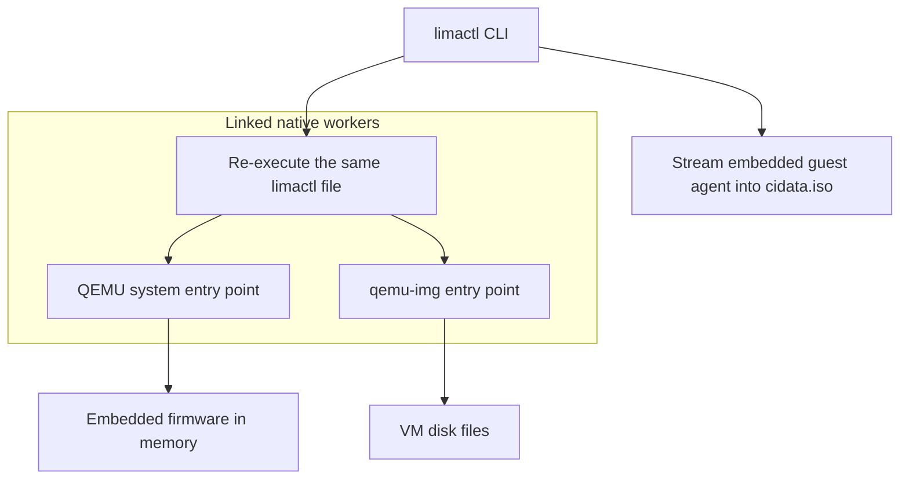
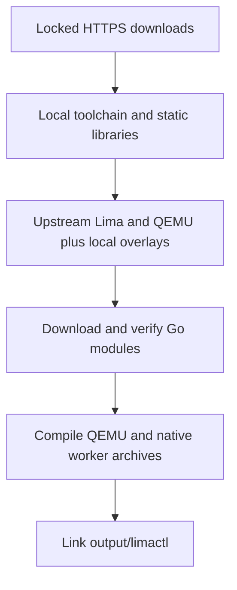

# Single-file Lima

**One executable for Lima, QEMU, and their runtime assets—without unpacking a dependency bundle.**

**Intel macOS Catalina, with 42 school Macs in mind.** This experimental, headless build
links Lima and QEMU into a single `limactl` executable. Firmware, templates, and
the Linux guest agent are embedded; third-party native libraries are statically
linked. VM disks and instance state remain ordinary files.

> **Experimental:** the local build was boot-tested on macOS Catalina 10.15.7
> (x86_64). CI uses macOS 15 Intel and a modern SDK; its smoke checks do not establish
> Catalina compatibility or VM/HVF support. Executables are not signed or notarized.

## Contents

- [Quick start](#quick-start)
- [Storage](#storage)
- [How it works](#how-it-works)
- [Building from source](#building-from-source)
- [Validation](#validation)
- [CI and releases](#ci-and-releases)
- [Repository layout](#repository-layout)
- [Limitations](#limitations)
- [Licensing](#licensing)
- [Contributing](CONTRIBUTING.md)

## Features

- Lima CLI, QEMU system emulator, and `qemu-img` in one executable.
- In-memory BIOS/UEFI, option ROMs, and keymaps—no host-side firmware extraction.
- 38 embedded templates and the Linux x86_64 guest agent.
- HVF hardware acceleration, TCG emulation, user-mode networking, and VirtFS/9p.
- First-use storage prompt with `~/goinfre/lima-home` as the default.
- No third-party dylib bundle; dynamic dependencies are macOS system libraries.

## Quick start

### Get the executable

For CI-built artifacts, check the repository's
[GitHub releases](https://github.com/ismail-el-moufid/lima-singlefile-ci/releases).
Successful `v*` tag builds publish experimental prereleases, not stable/latest
releases. If no suitable artifact is available, [build from source](#building-from-source).

Download `limactl-macos-x86_64` and `SHA256SUMS` from the **same release** into an
empty directory. From that directory, verify the checksum before making it executable:

```sh
shasum -a 256 -c SHA256SUMS
chmod +x limactl-macos-x86_64
mv limactl-macos-x86_64 limactl
```

Stop if checksum verification fails. Checksums detect mismatched or corrupted
assets; they are not a signature.

For a local build, the executable is at `output/limactl`. Copy **only that file**
to a directory of your choice. Neither route needs an installed QEMU or a
third-party runtime bundle.

### Start a VM

The default example in this guide is Alpine with Docker, `ble.sh`, and a
colored Git-aware Bash prompt. From the directory containing `limactl`:

```sh
./limactl --version
./limactl start --list-templates
./limactl start alpine-docker
./limactl shell alpine-docker
./limactl stop alpine-docker
```

Initial VM creation normally downloads an OS image. The executable is not an
offline OS distribution, and SSH/SCP and other macOS system tools remain runtime
dependencies. Developer Tools group membership is not required to run it.

### Included setup

The embedded `alpine-docker` template requires a build containing it. With an
older executable, use the template file directly from this checkout:

```sh
./output/limactl start --name=alpine-docker ./src/lima/examples/alpine-docker.yaml
```

The template installs Docker with OpenRC, sets the VM user’s shell to Bash,
loads a commit-pinned `ble.sh` in interactive Bash, and adds that user to the
`docker` group. The colored prompt shows the current directory, Git branch (or
detached commit), and a `*` for uncommitted changes. Git tab completion is enabled;
your Git identity is not configured. First boot needs network access to Alpine repositories and
GitHub. If `docker info` reports permission denied, stop and start the VM to
refresh SSH group membership. Docker group membership is root-equivalent
inside the guest.

**Legacy image:** like the existing Alpine template, this uses Alpine 3.16,
which is end-of-life. Use it for compatibility/testing, not production.

### Storage

First foreground storage access prompts:

```text
Lima storage directory [~/goinfre/lima-home]:
```

Press Enter for the default, or enter an absolute path or a `~/` path. The confirmed
choice is saved in `~/goinfre/lima-config.json` with permissions `0600`.

- `LIMA_HOME` overrides the saved choice.
- Noninteractive calls use saved/default storage without saving an unconfirmed choice.
- Help, version, completion, and template listing do not prompt.
- Downloads are cached under `<LIMA_HOME>/_cache`.
- Each instance has its own directory, such as `~/goinfre/lima-home/alpine-docker/`.

An instance directory contains `lima.yaml`, virtual disks, `cidata.iso`, logs, and
runtime sockets. Files inside Linux live in its virtual disk; access them through
`./limactl shell alpine-docker` or configured shared mounts.

## How it works

Lima re-executes the **same executable** as a dedicated native worker. These are
separate processes, not separate installed QEMU binaries.



The private worker flags are `--internal-qemu` and `--internal-qemu-img`. Native
entry points run on the pinned Darwin startup thread with C-owned arguments.
Shared block objects are linked once, and QEMU registration constructors are
retained. Private signal adaptations allow QEMU to coexist with Go's runtime.

Firmware is served through the read-only `builtin:<name>` protocol. The guest
agent streams directly into the final `cidata.iso`; it is not first extracted to
a host-side executable. Disks, ISO setup data, SSH keys, downloads, and logs are
intentional runtime files, not an unpacked dependency bundle.

See the [Lima integration notes](src/lima/docs/single-file.md) and
[embedded firmware notes](src/qemu/util/builtin-resources/README.md) for details.
These include historical implementation notes. The root-level build and validation
commands below describe the supported workflow and the latest verified executable.

## Repository layout

| Path | Purpose |
| --- | --- |
| `src/lima/` | Lima authoring/reference snapshot, required overlays, templates, and guest agent |
| `src/qemu/` | QEMU authoring/reference snapshot, required overlays, and embedded native resources |
| `src/libslirp-*/` | Pinned libslirp reference snapshot and license notices |
| `build.py` | One-command online preparation and full build |
| `bootstrap.py`, `build_support.py` | Verified tool/library downloads, local builds, SDK discovery |
| `prepare_sources.py` | Download upstream sources and apply explicit local overlays |
| `dependencies.lock.json`, `sources.lock.json` | Pinned download URLs, versions, and SHA-256 checksums |
| `source-overlays.json`, `native/` | Single-file modifications, embedded assets, and runtime overrides |
| `build/self-contained/sources/` | Reconstructed upstream sources used by the build |
| `build/self-contained/` | Active native builds, preparation stamps, and generated linker inputs |
| `tools/`, `prefix/`, `cache/` | Reusable local toolchain, installed native dependencies, and caches |
| `output/` | Built executable, checksum, build manifest, and local validation reports |
| `build_native.py` | Static libslirp and QEMU build steps |
| `link_lima.py` | Private native archives, generated CGO flags, final Go link |
| `build-contract.json` | Worker, firmware, platform, and storage contract |
| `tests/validate_*.py` | Native, interactive-prompt, and VM boot validators |
| `downloads/*.json` | Download provenance metadata |
| `.github/workflows/build.yml` | Intel macOS CI checks and tag-triggered prereleases |
| `compliance/`, `RELEASE-REVIEW.md` | License evidence, notices, source-delivery materials, and unresolved findings |
| `LICENSE-ORIGINAL.md` | License scope for original project contributions only |
| `CONTRIBUTING.md` | Change, validation, and release checklist |

Build directories, installed dependency prefixes, downloaded images/archives,
logs, final binaries, generated link flags, and disposable test state are covered
by `.gitignore`. Required embedded resources and the pinned QEMU subproject sources
are **not** build-output exclusions.

The supported build compiles reconstructed sources, but source-verification tests
also require the retained upstream Lima and QEMU snapshots. Files absent from the
overlay manifest are not automatically disposable.

## Building from source

From the repository root:

```sh
python3 build.py
```

This downloads Lima, QEMU/UTM, libslirp, QEMU's required subprojects, Go 1.22.12,
LLVM 10.0.1, Ninja 1.13.2, Meson 1.5.0 and its Python build helpers, plus pkgconf,
libffi, zlib, GLib and proxy-libintl. It builds the third-party native libraries
statically and downloads Lima's Go modules using the pinned `go.mod`/`go.sum` from
the reconstructed Lima sources.
No preinstalled Lima, QEMU, Go, LLVM, Homebrew packages, or prepared dependency
bundle is required.

### Host prerequisites

- Intel macOS; the validated target is **macOS Catalina 10.15.7**.
- **Python 3.8+** with `venv`, `ensurepip`, and `lzma` (tested with Python 3.9).
- **Apple developer tools and a compatible macOS SDK**, selected by `xcode-select`;
  `xcrun` locates the SDK, linker, and archive tools. The tested SDK is macOS 10.15.
- Working system `curl` with HTTPS certificate verification and internet access
  for initial downloads. Allow several GiB of free disk space.

Apple's SDK/tools and the bootstrap Python interpreter are host prerequisites,
not redistributed or silently installed by this project. Newer SDKs/macOS versions
are not assumed compatible merely because the deployment target is set to 10.15.

The default compiler is pinned LLVM/Clang 10 (`LIMA_COMPILER=llvm`). For an
experimental build with a modern SDK, use `LIMA_COMPILER=apple python3 -B build.py`
to select Apple Clang and Clang++ through `xcrun` for Ninja, native libraries, QEMU,
and cgo. Keep the same setting for preparation, builds, and offline reuse. The
compiler mode is part of the build identity: switching modes rejects existing
incompatible build state rather than silently reusing it. Use a fresh workspace
when switching. Both modes retain the 10.15 deployment target; Apple-Clang mode
does not establish Catalina runtime compatibility. The pinned LLVM archive tool
is still used for final archive assembly.

### Download, build, and resume



Downloads are verified against the lock files before extraction. Go modules use
`proxy.golang.org` and the Go checksum database; module files must remain unchanged.
Network requests go to the upstream hosts listed in the lock files and the Go
module services. No credentials are required. Initial toolchain downloads alone
are over 500 MB; subsequent runs reuse verified local downloads.

All tool installations, dependency prefixes, caches, temporary files, and build
outputs live **inside this repository**. The scripts do not use a sibling tree.
Lima and QEMU are reconstructed in `build/self-contained/sources/` from online
archives, then receive only the local files listed in `source-overlays.json`.
The existing `src/` snapshots are retained as the overlay authoring/reference
layer, not used as a prebuilt dependency installation. Their embedded guest agent,
firmware, notices, and extra template are checksum-locked project assets; they
remain checked in so no separately supplied runtime bundle is needed.

To prepare everything online now and compile without downloads later:

```sh
python3 build.py --prepare-only
python3 build.py --offline
```

Individual archive caches can also be populated with `python3 bootstrap.py
--download-only` and `python3 prepare_sources.py --download-only`; these commands
do not prepare the Go module cache or constitute a complete offline setup.

Rerunning `python3 build.py` resumes verified preparation and incremental builds.
Changed inputs, altered generated sources, and conflicting installations fail
rather than silently overwriting local work. For a clean rebuild after changing
pins, preserve any edits, move the generated `build/self-contained/`, `tools/`,
and `prefix/` directories aside, and rerun the build; verified `downloads/` and
`cache/` contents can be retained. If intentionally editing an overlay in `src/`,
update its checksum in `source-overlays.json` as part of that change. Native runtime
override changes likewise require matching checksums in `native/overrides.json`.
Preserve and reconstruct stale generated sources rather than editing their
preparation stamps to bypass verification.

The result is `output/limactl`, with full logs under `logs/` and provenance in
`output/build-manifest.json`. Generated CGO linker flags stay under
`build/self-contained/sources/lima/cmd/limactl/`; do not commit build outputs.
The supported build uses `build/self-contained/`; the former top-level native
build directories and authoring-tree linker flags are not required.

### Source versions

| Component | Base version / revision |
| --- | --- |
| Lima | 0.13.0 |
| QEMU / UTM | `v10.0.2-utm`, `37ba092d59aff24900dfd0d5e01d4ed68441ba07` |
| libslirp | 4.9.1, `9c744e1e52aa0d9646ed91d789d588696292c21e` |

Firmware provenance and per-resource hashes are recorded in the
[resource manifest](src/qemu/util/builtin-resources/manifest.json). The libslirp
archive checksum is in [download metadata](downloads/libslirp.json).

## Validation

### Historical local validation

The following results were recorded for the rebuilt macOS 10.15.7 executable on
**2026-09-15**. They are not results for the current working tree or a CI release:

| Coverage | Result |
| --- | --- |
| Offline bootstrap, build, source-preparation, and validator unit tests | 123 tests passed |
| Native workers, relocation, image operations, firmware, networking, signals, HVF | 23 checks passed |
| Real-PTY storage prompt, persistence, permissions, overrides, informational commands | 15 checks passed |
| Full Lima CLI Go test package, including shutdown regressions | 10 top-level tests passed |
| Concurrent Alpine BIOS and embedded-UEFI VM lifecycles under HVF | 6 lifecycles passed across 3 rounds |
| Regression check temporarily restoring event-only shutdown behavior | All 3 premature-exit cases failed as expected |

All six VM runs verified SSH, the embedded guest agent, bidirectional writable 9p
mount access, stop, immediate restart, post-restart shared-file access, final
shutdown, and cleanup. No restart sleeps or retries were added to the validators.

Graceful stop now waits for both the original host-agent and QEMU processes to
terminate within the existing three-minute deadline. An earlier build returned
on the host agent's "exiting" event and could reject an immediate restart with
`host agent is running but qemu is not`; regression tests cover that race, both
process-exit orders, timeout, and cancellation.

The tested executable is **81,235,004 bytes (about 77.5 MiB)**. Its checksum is in
`output/limactl.sha256`; artifact size and hashes may change when rebuilt.

### Run checks locally

Run the offline unit suite, including bootstrap, source-preparation, and
compliance-integrity checks, from the repository root:

```sh
python3 -B -m unittest discover -s tests -p 'test_*.py' -v
```

Integrity checks validate retained evidence against its recorded hashes. If a
check reports a mismatch, investigate the changed input and its provenance rather
than regenerating hashes merely to silence the failure.

With a freshly built executable, run:

```sh
python3 fetch_test_image.py
python3 tests/validate_native.py
python3 tests/validate_prompt.py
python3 tests/validate_boot.py
python3 tests/validate_boot.py --uefi
```

`fetch_test_image.py` downloads or verifies the pinned Alpine ISO under
`downloads/`, using `tests/fixtures.lock.json` and both SHA-256 and SHA-512 checks.
Alternatively, include it in preparation with `python3 build.py --prepare-only
--with-test-image`. The native validator checks firmware against the repository's
resource manifest; it needs no external firmware files. Downloaded images are
intentionally not committed. Validators create isolated state and
retain results under `tests/`; those generated directories are ignored by Git.

Local aggregate reports, checksums, and build manifests under `output/` are also
ignored; they are not promised to exist in a clone. `output/validation.json` records
the validated executable hash and links to individual results;
`output/stop-concurrent-validation.json` records the three concurrent test rounds.
Regenerate and review validation records for each new build rather than treating
these local results as CI.

### Workspace cleanup

- Keep `src/`, `native/`, lock files, overlay manifests, test scripts, embedded
  resources, provenance metadata, and license notices. They are source inputs or
  reference material, not generated clutter.
- Keep `build/self-contained/`, `tools/`, `prefix/`, `cache/`, and downloaded archives
  when reusing the prepared or offline build. Removing them may require preparation,
  downloads, or recompilation again.
- Old generated directories under `tests/` can be removed after their processes
  have stopped, provided no retained report references them. The current validation
  retains six successful concurrent VM runs, native/prompt results, and the two
  pre-fix failure runs.
- Temporary files and obsolete backup/staging directories can be removed after
  their owning commands finish and any unique changes have been preserved.
- `.gitignore` prevents generated outputs from being added accidentally; it does
  not make every ignored file safe to delete or replace filesystem backups.

## CI and releases

`.github/workflows/build.yml` runs on pushes and pull requests to `main`, pushes of
`v*` tags, or manually from the Actions tab. It explicitly selects
**`macos-15-intel`** and Python 3.11;
`macos-latest` is not suitable because this build requires an Intel host.

The workflow runs offline unit tests, builds with `LIMA_COMPILER=apple` so the
compiler matches the runner's modern SDK (other dependencies remain pinned),
checks source reconstruction using the downloaded archives, and smoke-tests a
relocated executable with no project toolchain on its runtime `PATH`. Checks cover
the CLI, embedded template inventory, native-worker versions, image operations,
and system-only dynamic libraries. It does not start VMs or assume hosted-runner
HVF support.

This is an **experimental modern-SDK build**, not proof of Catalina runtime
compatibility. The previously validated Catalina build and hardware-accelerated VM
checks remain separate. Each job is limited to two hours; private repositories
consume the account's included or billable Actions minutes.

Actions are pinned to commit SHAs and checkout credentials are not persisted.
The build job has `contents: write` permission to create releases. After all build
and verification steps succeed, a `v*` tag push immediately publishes a GitHub
prerelease (not a draft or the latest release) with `limactl-macos-x86_64` and
`SHA256SUMS`. These assets come from that CI run, not the retained local executable.
Branch pushes, pull requests, and manual runs do not publish releases. An existing
release for the tag is not overwritten; release creation fails instead.
Diagnostic logs are retained for seven days.

Verify the downloaded assets with `shasum -a 256 -c SHA256SUMS`, then run
`chmod +x limactl-macos-x86_64` before use. CI does not validate Catalina runtime
compatibility or VM/HVF operation.

## Limitations

- Local VM validation covers Intel macOS Catalina 10.15.7 with x86_64 guests;
  CI on macOS 15 Intel runs non-VM smoke checks only. Apple Silicon is not supported
  by this build workflow.
- Headless: no GUI display stack, vmnet, or plugins.
- Native-worker daemonization and memory preallocation are rejected.
- Writable firmware and persistent UEFI VARS are not provided.
- VM images and optional container-runtime installations may require network access.
- The pinned Alpine 3.16 image is an old regression fixture, not a production recommendation.
- No signing/notarization or cross-platform validation is provided.
- Dependency versions are pinned for Catalina compatibility, not claimed to be current or security-supported.

## Licensing

[MIT covers original project contributions only](LICENSE-ORIGINAL.md).
Third-party components retain their own licenses: [Lima](src/lima/LICENSE),
[QEMU](src/qemu/LICENSE) ([COPYING](src/qemu/COPYING)), and
[libslirp](src/libslirp-9c744e1e52aa0d9646ed91d789d588696292c21e/COPYRIGHT).

`./limactl licenses` displays Lima's license and asset notes. Additional component
notices, firmware provenance, and source-delivery materials are retained under
[`compliance/`](compliance/).

The [licensing and source inventory](RELEASE-REVIEW.md) documents the reviewed
Apache-2.0/GPLv2-only combination and remaining notice and source-delivery gaps.
