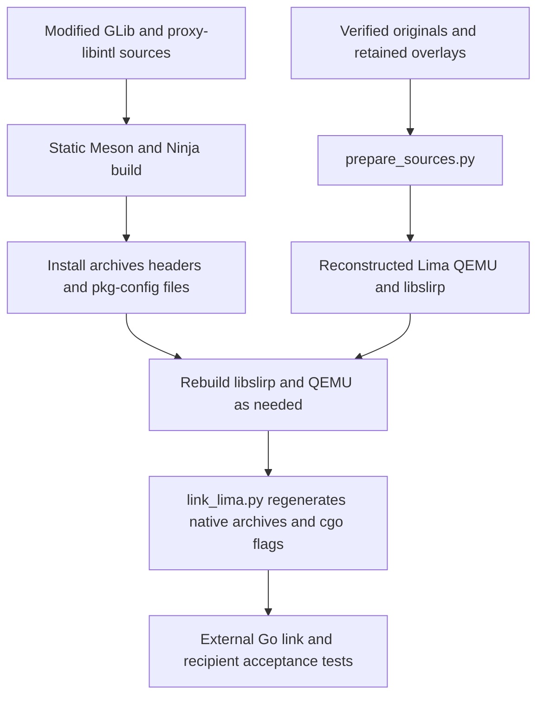

# Offline source delivery — permission still blocked

This directory contains **actual source bytes**, not a set of download links or a
notice-only bundle. `manifest.json` gives the delivered file counts, sizes,
SHA-256 hashes, live local build-input observations and unresolved gaps.
`acquisition.json` explicitly identifies every local input, its upstream URL
(where applicable), pin, classification and delivery path. No network access is
performed by `package.py`.

**This is not redistribution clearance or a declaration of complete legal
corresponding source. The full combined-work permission blocker persists.**
No licenses, permissions, exceptions or relicensing authority are created here.
The main task owns the exporter, root documentation and license decision.

## Delivered bytes and provenance

* `archives/`: the six unmodified archives from `sources.lock.json` (Lima,
  QEMU, libslirp, keycodemapdb, Berkeley SoftFloat and TestFloat); the locked
  GLib, proxy-libintl, libffi and zlib source archives; useful native build-tool
  sources Ninja and pkgconf; four locked Python build-tool wheels (Meson,
  pycotap, packaging and tomli), explicitly classified as wheels rather than
  claiming they are upstream source-release tarballs.
* `archives/go1.19.2.src.tar.gz`: the **unmodified historical Go source release**
  pinned by `compliance/notices/historical-go.lock.json`, checked against its
  official-catalog record. This is the embedded guest agent's recorded runtime
  version, not evidence that the guest executable was rebuilt.
* `archives/go1.22.12-source-subset.tar.gz`: source files selected from the
  **SHA-256-verified host distribution** locked in `dependencies.lock.json`.
  This is not represented as an official upstream source-release archive.
  `go1.22.12-members.json` records the original distribution digest, each retained
  member's original name, content digest, size and mode, and excluded regular
  members. Source, API, tests, documentation, misc/lib support and top-level
  notices/version/config files are retained. Ownership and timestamps are
  normalized. `bin/`, `pkg/` and every `.syso` are excluded. Source test trees may
  still contain binary-format test fixtures/data; this is not a claim that every
  member is text. Optional race/BoringCrypto objects are not delivered in the
  host subset. The historical upstream source release is left untouched.
* `modules/`: **52 unique host+guest module-version ZIPs**, selected from the
  two recorded binaries in `compliance/notices/manifest.json`, de-duplicated by
  module path and version. Each ZIP is checked using Go's `dirhash.Hash1`
  algorithm over actual member bytes against both recorded `h1` and the locked
  Lima archive's `go.sum`. Adjacent `.ziphash` files are never trusted.
* `modules/` also includes all locally available `.mod` files with a matching
  `version/go.mod` pin in that same `go.sum` (including graph versions outside
  the 52 binary-selected ZIPs). Each is checked as `Hash1({"go.mod": bytes})`.
  Available `.info` records for the 52 selected versions are retained with
  SHA-256 provenance, **not** falsely called h1-authenticated metadata.
  Missing pinned `.mod` records are listed explicitly in both manifests.

Original source archives and module ZIPs preserve upstream notices and source
headers unchanged, including upstream vendored portions and build scripts.
QEMU's original archive contains upstream firmware binaries too: “source
archive” does not mean every member is source. Additional firmware source
archives remain under `compliance/firmware/sources/`, covered by that agent's
manifests; preserve that export selection as well. This package neither
supersedes that audit nor fills its remaining firmware build/source gaps.

The compiled Go/LLVM distributions are deliberately **not copied**. Their
absence reduces source-delivery size but means this is not a self-contained
bootstrap toolchain. URLs in acquisition records are provenance, not a substitute
for the source bytes shipped here.

## Generate, verify and export

From the repository root (Python 3.9+ for this packager):

```sh
python3 compliance/source-delivery/package.py build
python3 compliance/source-delivery/package.py verify
# Producer-only: additionally check the original ignored caches/downloads.
python3 compliance/source-delivery/package.py verify --with-inputs
python3 -m unittest discover -s tests -p test_source_delivery.py
```

`build` is offline and fail-closed. It derives its acquisition list from existing
pins, bounds each file to 128 MiB, the acquisition/output payload to 256 MiB,
and archive expansion to 1 GiB / 100,000 members. It rejects symlinked filesystem
paths, traversal, duplicate archive members and special/escaping archive links;
it never extracts upstream archives. Existing different output bytes are not
overwritten. Use a fresh export/work copy to regenerate after input changes,
retaining the old package for comparison rather than deleting user work.

`verify` needs the package and its referenced retained export inputs, not the
original downloads/module cache or host Go distribution. It checks all payload
bytes, Go checksums, subset-member provenance, selection coverage, gap status,
and export references. An attacker able to replace all manifests and code can
replace their hashes too: these are integrity/provenance records, not signatures.
The exporter should hash/sign the outer export manifest using its own policy.

### Machine-readable exporter handoff

`export-allowlist.json` contains repository-relative **exact paths, SHA-256 and
sizes**:

* `additions`: this directory's payload, manifests, README and packager, plus
  `tests/test_source_delivery.py`.
* `required_retained_files`: scripts, source/overlay locks, individual local
  source/asset overlays, native overrides, Lima graph files and upstream audit
  inputs required alongside the archive originals. They are referenced rather
  than duplicated; the main export must retain their actual bytes.
* `self`: include `compliance/source-delivery/export-allowlist.json` itself and
  hash it in the outer export manifest (a recursive self-hash is not possible).

The six originals plus `source-overlays.json`/`native/overrides.json` and their
referenced files deliver upstream originals **and** this project's modifications.
`prepare_sources.py` applies these to a separate, stamped build source tree.
Keep the rest of the existing `src/`, notices, firmware, build/install scripts
and main export policy; this allowlist is an addition, not permission to prune
those inputs. No exporter/root-doc changes were made here.

## Recipient rebuild and modified static-library relinking recipe

**Recipe grounded in code, not a demonstrated modified-library rebuild.**
No full native rebuild, modified GLib/proxy-libintl install, final relink or
runtime validation was executed for this delivery. See machine-readable gaps.



### 1. Host prerequisites and restore the sources

The existing recipe targets **Intel macOS**, Darwin/amd64, with a 10.15 deployment
target. `build_support.py` obtains the Apple SDK, linker, archiver and tools via
`xcrun`; it defaults to the locked LLVM compiler. Python with `venv`/`ensurepip`
and make are prerequisites. Apple SDK/toolchain redistribution is not supplied
or authorized by this package. The locked Go and LLVM binary distributions must
be supplied separately to run the **unmodified** `bootstrap.py`, which downloads
or verifies **all** `dependencies.lock.json` inputs even when only a native
library is desired. We did not fetch these again or ship them here. Rebuilding
Go from supplied runtime/tool sources requires a suitable bootstrap Go compiler;
the host subset is not a drop-in replacement for the binary distribution pin.

In a **separate recipient working copy**, verify this package, then copy each
untransformed `archives/` record to the `downloads/` filename in its acquisition
origin. Do not copy the Go subset under the binary-distribution filename; it
cannot pass that distribution's SHA-256 check. Supply missing tools explicitly
before running bootstrap if an offline build is required. The upstream archive
build/install scripts are within the supplied originals, and project scripts are
hashed export references.

For the module cache, copy the `modules/` tree to
`cache/modules/cache/download/` (preserving case-escaped paths and bytes).
Alternatively `modules/` is laid out as a `file://` Go proxy for inspection with
an explicitly absolute proxy URL. The actual link script forces `GOPROXY=off`,
`GOMODCACHE=cache/modules`, `GOTOOLCHAIN=local`, `GOENV=off`, and `-mod=readonly`,
so populate its expected cache before linking. Available metadata helps resolve
the graph; it is **not proof** that every build/test dependency ZIP or graph
record is present. No claim of a complete offline Go graph is made.

Once prerequisites and caches are available, the existing baseline sequence is:

```sh
python3 bootstrap.py
python3 prepare_sources.py
python3 build_native.py slirp
python3 build_native.py configure
python3 build_native.py build
python3 link_lima.py
```

This sequence is explanatory, **not run in this task**. Source preparation checks
immutable stamped trees; bootstrap checks input contexts and installed-output
signatures. Never “fix” these checks by forging receipts or silently deleting
work. Keep the baseline build and perform modified-library experiments in a
separate workspace/copy with clearly recorded changes.

### 2. Modify and rebuild GLib plus proxy-libintl

Extract `glib-2.66.8.tar.xz` into a new modification tree, then extract
`proxy-libintl-0.1.tar.gz` into that tree's `subprojects/proxy-libintl` (strip
one archive root using the retained `bootstrap.extract` helper). Do not edit
`build/self-contained/dependency-sources/` in place and expect bootstrap's
extraction/completion receipts to bless the edits. Record a patch against these
originals and keep all upstream notices. Edit GLib and/or proxy-libintl there.

`bootstrap.py:_glib` is the exact build/install recipe to reproduce in a separate
Meson build directory with the environment from `build_support.environment()`:

```text
meson setup MODIFIED_BUILD MODIFIED_GLIB_SOURCE
  --prefix=RECIPIENT_PROJECT/prefix --libdir=lib
  --buildtype=release --default-library=static --wrap-mode=nodownload
  -Dinternal_pcre=true -Dnls=disabled -Diconv=auto
  -Dgtk_doc=false -Dman=false -Dinstalled_tests=false
  -Dlibmount=disabled -Dselinux=disabled -Dxattr=false -Dfam=false
  -Ddtrace=false -Dsystemtap=false -Dsysprof=disabled -Doss_fuzz=disabled
```

These uppercase paths are **recipient-selected paths**, not shell commands to
paste without substitution. Use the project-local Meson and Ninja from
`build_support.MESON` and `build_support.NINJA`, not arbitrary host versions.
The environment selects SDK flags, static prefix and isolated pkg-config paths.
Bootstrap builds libffi with `--disable-shared --enable-static --disable-docs`
and zlib with `--static`; originals for both are supplied even though building
libffi alone is not proof it contributes to the final binary.

As `_glib` does, obtain target filenames with `meson introspect --targets
MODIFIED_BUILD`. Build **exactly** `libglib-2.0.a`, `libgthread-2.0.a` and the
subproject's `libintl.a` with Ninja, using their paths relative to MODIFIED_BUILD.
`libintl.a` here is proxy-libintl, not an invented gettext permission grant.

Reproduce `_glib`'s deliberately minimal install, rather than assuming a full
`meson install` is equivalent:

1. Copy the three rebuilt archives to the recipient `prefix/lib/`.
2. Use `meson introspect --installed MODIFIED_BUILD` to copy GLib's core headers
   under `prefix/include/glib-2.0/glib/`, the root `glib.h`, `glib-unix.h`,
   `gmodule.h`, and generated `prefix/lib/glib-2.0/include/glibconfig.h`.
3. Install `glib-2.0.pc` and `gthread-2.0.pc` into `prefix/lib/pkgconfig/`.
   The existing script checks more than 50 headers and both metadata files.
4. Check `prefix/bin/pkgconf --static --libs glib-2.0 gthread-2.0` under the same
   environment and ensure no unexpected `.dylib` has entered the prefix.

This deliberate replacement invalidates baseline bootstrap output receipts.
Do **not** rerun bootstrap and expect it to accept modified outputs, change
locked upstream hashes to disguise the modification, or treat cached completion
as proof of a rebuilt modified library. Preserve the baseline and document the
modified workspace, patch, build commands, installed hashes and header/ABI
compatibility. A convenient automated modified-source driver and its validation
are still missing; the recipe above is manual, derived from existing code.

### 3. Rebuild consumers and perform the final link

After installing modified archives, rebuild libslirp/QEMU in the modified
workspace with the retained `build_native.py` steps, especially if headers or
ABI changed. QEMU configuration uses static pkg-config, `--disable-download`,
`--disable-shared-lib`, the x86_64 softmmu target, and the explicit feature list
in `build_native.py:configure`; do not substitute a generic QEMU configure line.
A fresh configuration/build is safer than assuming old generated state remains
valid after ABI/header changes.

`link_lima.py` is **not just a standalone linker invocation**. It needs QEMU's
`compile_commands.json`, build.ninja/response files, generated headers, objects
and utility archive. It recompiles six entry/override units, replaces utility
members, aggregates the QEMU core, obtains the Ninja target link command,
substitutes the utility archive, carries through its static archive arguments,
and emits `native_link_flags.go` into the prepared Lima tree. It force-loads
`libqemu-embedded.a` and performs `go build` with cgo and external linking to
`output/limactl`. Keep native override sources and the Lima cgo/native sources
listed by the export references. Re-run it after rebuilding the native inputs;
check the final flags select the **modified** prefix archives.

To demonstrate a recipient's route, retain the patch, compile/install records,
new archive hashes, generated flags, actual external-link argv/link map, output
hash and focused runtime/modified-behavior tests. Merely delivering unchanged
archives or an object listing does not demonstrate that the modified library
can be used. The existing `tests/validate_native.py` and integration tests are
starting points, not claimed successful modified-library tests here.

### Live ignored files are not missing merely because a listing hides them

`manifest.json:local_relink_inputs` records terminal-observed existence and hashes
for selected private QEMU/GLib build files, native archives, generated cgo flags,
bootstrap receipt and prefix archives. They are **not shipped in this package**.
Older prose in the linkage manifest reports some of these as absent; that does
not describe this live ignored workspace accurately. Availability is not an
attestation that every object corresponds to the supplied sources, nor does it
supply a final linker map or a modified-library result. The recipient must
regenerate that build state or deliberately obtain a separately inventoried
relink object package. No existing build artifacts were changed for this task.

## Corresponding source versus identical recreation

Supplying corresponding source concerns the applicable license's definition,
including relevant modifications and build/install scripts where required.
A **bit-identical binary recreation is not a universal license requirement**.
It is a separate engineering/provenance goal, useful for confirming historical
firmware/guest builds or auditing an exact artifact. Conversely, byte-identical
recreation alone would not resolve incompatible permissions, incomplete notices
or other applicable obligations. This delivery makes neither claim.

## Decisions still required from the user/main task

1. Resolve the **full combined-work permission blocker** with qualified review:
   obtain needed permissions, select a legally supportable distribution design,
   or refrain from distributing the combined artifact. No outcome is preselected.
2. Have the main exporter include the hashed additions and required retained
   source/build inputs, preserve firmware/notices selections, and reverify the
   resulting export. This task does not authorize release.
3. Decide whether to demonstrate a modified static-library rebuild/relink and
   its acceptance tests before distribution; select recipient toolchain/SDK
   availability and whether a separately inventoried object/relink kit is needed.
4. Address missing module graph metadata/archives and firmware source/build
   matches if a complete offline rebuild is required. Decide separately whether
   historical **bit-identical** recreation is a release/provenance objective.
